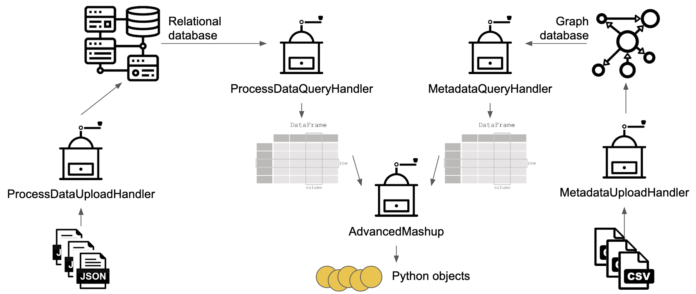
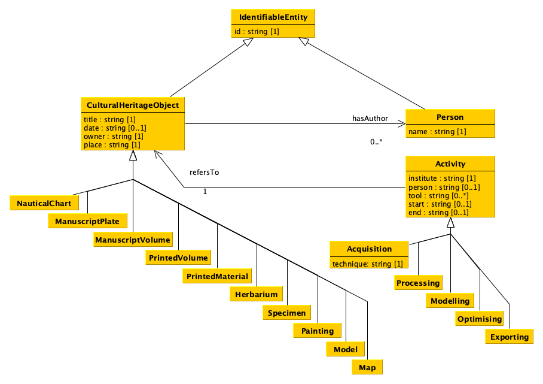
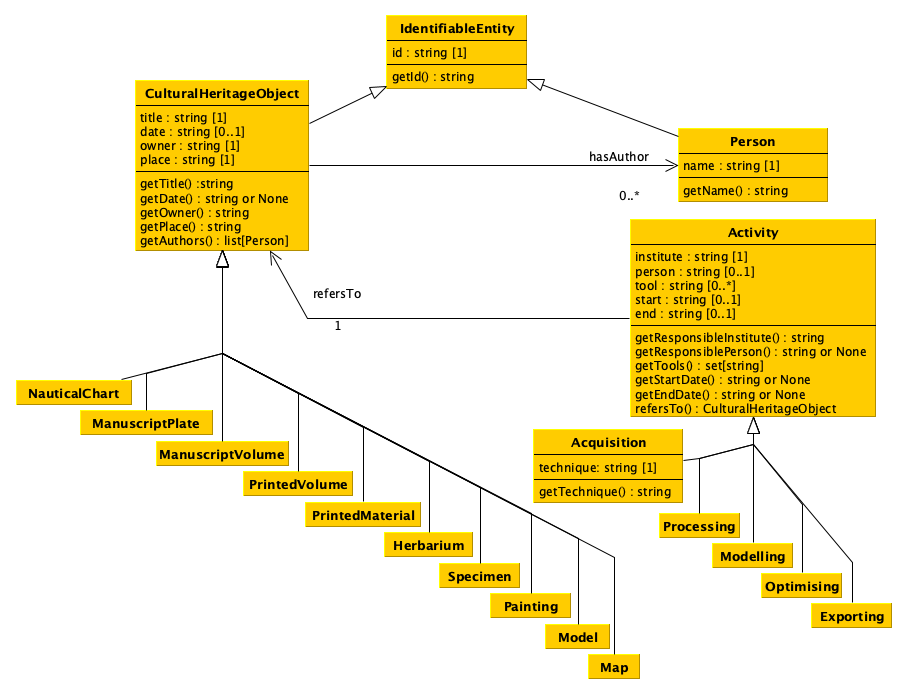
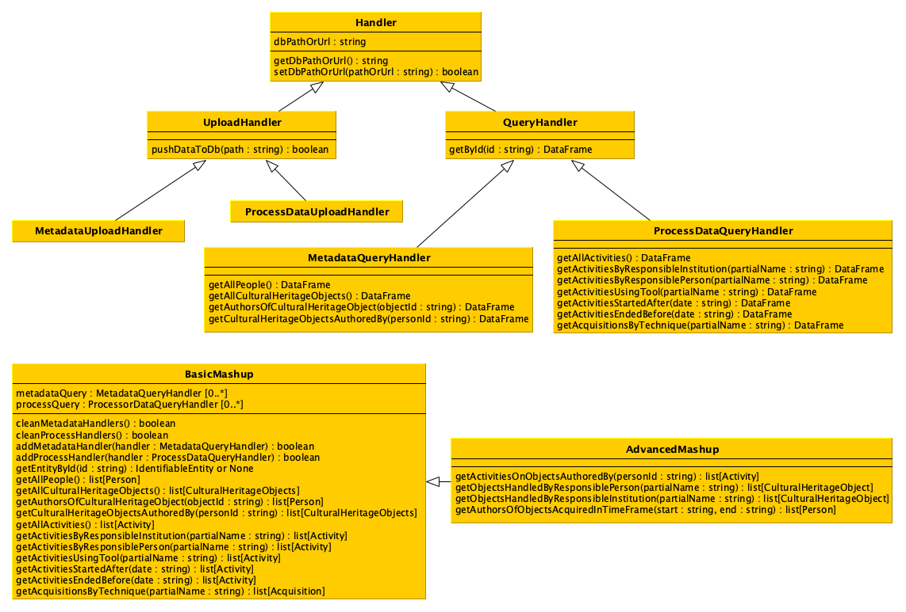

# Data Science: project

The goal of the project is to develop a software that enables one to process data stored in different formats and to upload them into two distinct databases to query these databases simultaneously according to predefined operations. 

## Data

Exemplar data for testing the project have been made available. In particular:

* for creating the relational database, there is one file, [a JSON file](data/process.json) containing information of the process of acquisition and digitisation of a cultural heritage object, which passes through five distinct activities: acquisiting, processing, modelling, optimising, exporting. The cultural heritage object is indentified by the attribute `object id`, which correspond to the identifier of the object the metadata file (see below).

* for creating the graph database, there is two one, [a CSV file](data/meta.csv), containing metadata about cultural heritage objects. Please note that multiple authors of the same object will be contained in just one string and split by `; `. In addition, the value between curvy brackets is not part of the name but it is the identifier for that person - meaning that multiple mentions of such identifiers in different rows refer always to the same person.


## Workflow



## Data model



## UML of data model classes



All the methods of each class must return the appropriate value that have been specified in the object of that class when it has been created. It is up to the implementer to decide how to enable someone to add this information to the object of each class, e.g. by defining a specific constructor. While one can add additional methods to each class if needed, it is crucial that the *get* methods introduced in the UML diagram are all defined.

## UML of additional classes



All the attributes methods of each class are defined as follows. All the constructors of each of the class introduced in the UML diagram do not take in input any parameter. While one can add additional methods to each class if needed, it is crucial that all the methods introduced in the UML diagram are defined.


### Class `Handler`

#### Attributes
`dbPathOrUrl`: the variable containing the path or the URL of the database, initially set as an empty string, that will be updated with the method `setDbPathOrUrl`.

#### Methods
`getDbPathOrUrl`: it returns the path or URL of the database.

`setDbPathOrUrl`: it enables to set a new path or URL for the database to handle.


### Class `UploadHandler`

#### Methods
`pushDataToDb`: it takes in input the path of a file containing annotations and uploads them in the database. This method can be called everytime there is a need to upload annotations in the database. The actual implementation of this method is left to its subclasses.


### Classes `MetadataUploadHandler` and `ProcessDataUploadHandler`

These two classes implements the method of the superclass to handle the specific scenario, i.e. `MetadataUploadHandler` to handle CSV files in input and to store their data in a graph database and `ProcessDataUploadHandler` to handle JSON files in input and to store their data in a relational database.


### Class `QueryHandler`

#### Methods
`getById`: it returns a data frame with all the identifiable entities (i.e. cultural heritage objects and people) matching the input identifier (i.e. maximum one entity if there exists one with the input id).


### Class `MetadataQueryHandler`

#### Methods
`getAllPeople`: it returns a data frame containing all the people included in the database.

`getAllCulturalHeritageObjects`: it returns a data frame with all the cultural heritage objects described in it.

`getAuthorsOfCulturalHeritageObject`: it returns a data frame with all the authors of the cultural heritage objects identified by the input id.

`getCulturalHeritageObjectsAuthoredBy`: it returns a data frame with all the cultural heritage objects authored by the person identified by the input id.


### Class `ProcessDataQueryHandler`

#### Methods
`getAllActivities`: it returns a data frame with all the activities included in the database.

`getActivitiesByResponsibleInstitution`: it returns a data frame with all the activities that have, as responsible institution, any that matches (even partially) with the input string.

`getActivitiesByResponsiblePerson`: it returns a data frame with all the activities that have, as responsible person, any that matches (even partially) with the input string.

`getActivitiesUsingTool`: it returns a data frame with all the activities that have, as a tool used, any that matches (even partially) with the input string.

`getActivitiesStartedAfter`: it returns a data frame with all the activities that started either exactly on or after the date specified as input.

`getActivitiesEndedBefore`: it returns a data frame with all the activities that ended either exactly on or before the date specified as input.

`getAcquisitionsByTechnique`: it returns a data frame with all the acquisitions that have, as a technique used, any that matches (even partially) with the input string.


### Class `BasicMashup`

#### Attributes
`metadataQuery`: the variable containing the list of `MetadataQueryHandler` objects to involve when one of the *get* methods below (needing metadata) is executed. In practice, every time a *get* method is executed, the method will call the related method on all the `MetadataQueryHandler` objects included in the variable `metadataQuery`, before combining the results with those of other `QueryHandler`(s) and returning the requested object.

`processQuery`: the variable containing the list of `ProcessorDataQueryHandler` objects to involve when one of the *get* methods below (needing acquisition and digitisation information) is executed. In practice, every time a *get* method is executed, the method will call the related method on all the `ProcessorDataQueryHandler` objects included in the variable `processQuery`, before combining the results with those of other `QueryHandler`(s) and returning the requested object.


#### Methods
`cleanMetadataHandlers`: it cleans the list `metadataQuery` from all the `MetadataQueryHandler` objects it includes.

`cleanProcessHandlers`: it cleans the list `processQuery` from all the `ProcessorDataQueryHandler` objects it includes.

`addMetadataHandler`: it appends the input `MetadataQueryHandler` object to the list `metadataQuery`.

`addProcessHandler`: it appends the input `ProcessorDataQueryHandler` object to the list `processQuery`.

`getEntityById`: it returns an object having class `IdentifiableEntity` identifying the entity available in the databases accessible via the query handlers matching the input identifier (i.e. maximum one entity). In case no entity is identified by the input identifier, `None` must be returned. The object returned must belong to the appropriate class – e.g. if the `IdentifiableEntity` to return is actually a person, an instance of the class `Person` (being it a subclass of `IdentifiableEntity`) must be returned.

`getAllPeople`: it returns a list of objects having class `Person` containing all the people included in the database accessible via the query handlers.

`getAllCulturalHeritageObjects`: it returns a list of objects having class `CulturalHeritageObject` containing all the people included in the database accessible via the query handlers. The objects included in the list must belong to the appropriate class – e.g. if the `CulturalHeritageObject` to return is actually a map, an instance of the class `Map` (being it a subclass of `CulturalHeritageObject`) must be returned.

`getAuthorsOfCulturalHeritageObject`: it returns a list of objects having class `Person` with all the authors of the cultural heritage objects identified by the input id.

`getCulturalHeritageObjectsAuthoredBy`: it returns a list of objects having class `CulturalHeritageObjects` with all the cultural heritage objects authored by the person identified by the input id. The objects included in the list must belong to the appropriate class – e.g. if the `CulturalHeritageObject` to return is actually a map, an instance of the class `Map` (being it a subclass of `CulturalHeritageObject`) must be returned.

`getAllActivities`: it returns a list of objects having class `Activity` with all the activities included in the database. The objects included in the list must belong to the appropriate class – e.g. if the `Activity` to return is actually an optimising activity, an instance of the class `Optimising` (being it a subclass of `Activity`) must be returned.

`getActivitiesByResponsibleInstitution`: it returns a list of objects having class `Activity` with all the activities that have, as responsible institution, any that matches (even partially) with the input string. The objects included in the list must belong to the appropriate class – e.g. if the `Activity` to return is actually an optimising activity, an instance of the class `Optimising` (being it a subclass of `Activity`) must be returned.

`getActivitiesByResponsiblePerson`: it returns a list of objects having class `Activity` with all the activities that have, as responsible person, any that matches (even partially) with the input string. The objects included in the list must belong to the appropriate class – e.g. if the `Activity` to return is actually an optimising activity, an instance of the class `Optimising` (being it a subclass of `Activity`) must be returned.

`getActivitiesUsingTool`: it returns a list of objects having class `Activity` with all the activities that have, as a tool used, any that matches (even partially) with the input string. The objects included in the list must belong to the appropriate class – e.g. if the `Activity` to return is actually an optimising activity, an instance of the class `Optimising` (being it a subclass of `Activity`) must be returned.

`getActivitiesStartedAfter`: it returns a list of objects having class `Activity` with all the activities that started either exactly on or after the date specified as input. The objects included in the list must belong to the appropriate class – e.g. if the `Activity` to return is actually an optimising activity, an instance of the class `Optimising` (being it a subclass of `Activity`) must be returned.

`getActivitiesEndedBefore`: it returns a list of objects having class `Activity` with all the activities that ended either exactly on or before the date specified as input. The objects included in the list must belong to the appropriate class – e.g. if the `Activity` to return is actually an optimising activity, an instance of the class `Optimising` (being it a subclass of `Activity`) must be returned.

`getAcquisitionsByTechnique`: it returns a list of objects having class `Acquisition` with all the acquisitions that have, as a technique used, any that matches (even partially) with the input string.


### Class `AdvancedMashup`


#### Methods
`getActivitiesOnObjectsAuthoredBy`: it returns a list of objects having class `Activity` referring to the cultural heritage objects authored by the person specified by the input identifier. The objects included in the list must belong to the appropriate class – e.g. if the `Activity` to return is actually an optimising activity, an instance of the class `Optimising` (being it a subclass of `Activity`) must be returned.

`getObjectsHandledByResponsiblePerson`: it returns a list of objects having class `CulturalHeritageObject` with all the cultural heritage objects involved in any activity handled by the responsible person that matches (even partially) with the input string. The objects included in the list must belong to the appropriate class – e.g. if the `CulturalHeritageObject` to return is actually a map, an instance of the class `Map` (being it a subclass of `CulturalHeritageObject`) must be returned.

`getObjectsHandledByResponsibleInstitution`: it returns a list of objects having class `CulturalHeritageObject` with all the cultural heritage objects involved in any activity handled by the responsible institution that matches (even partially) with the input string. The objects included in the list must belong to the appropriate class – e.g. if the `CulturalHeritageObject` to return is actually a map, an instance of the class `Map` (being it a subclass of `CulturalHeritageObject`) must be returned.

`getAuthorsOfObjectsAcquiredInTimeFrame`: it returns a list of objects having class `Person` of the authors of the cultural heritage objects that have been fully acquired in the time window provided as input.


## Uses of the classes

```
# Supposing that all the classes developed for the project
# are contained in the file 'impl.py', then:

# 1) Importing all the classes for handling the relational database
from impl import ProcessDataUploadHandler, ProcessDataQueryHandler

# 2) Importing all the classes for handling graph database
from impl import MetadataUploadHandler, MetadataQueryHandler

# 3) Importing the class for dealing with mashup queries
from impl import AdvancedMashup

# Once all the classes are imported, first create the relational
# database using the related source data
rel_path = "relational.db"
process = ProcessDataUploadHandler()
process.setDbPathOrUrl(rel_path)
process.pushDataToDb("data/process.json")
# Please remember that one could, in principle, push one or more files
# calling the method one or more times (even calling the method twice
# specifying the same file!)

# Then, create the graph database (remember first to run the
# Blazegraph instance) using the related source data
grp_endpoint = "http://127.0.0.1:9999/blazegraph/sparql"
metadata = MetadataUploadHandler()
metadata.setDbPathOrUrl(grp_endpoint)
metadata.pushDataToDb("data/meta.csv")
# Please remember that one could, in principle, push one or more files
# calling the method one or more times (even calling the method twice
# specifying the same file!)

# In the next passage, create the query handlers for both
# the databases, using the related classes
process_qh = ProcessDataQueryHandler()
process_qh.setDbPathOrUrl(rel_path)

metadata_qh = MetadataQueryHandler()
metadata_qh.setDbPathOrUrl(grp_endpoint)

# Finally, create a advanced mashup object for asking
# about data
mashup = AdvancedMashup()
mashup.addProcessHandler(process_qh)
mashup.addMetadataHandler(metadata_qh)

result_q1 = mashup.getAllActivities()
result_q2 = mashup.getAuthorsOfCulturalHeritageObject("1")
result_q3 = mashup.getAuthorsOfObjectsAcquiredInTimeFrame("2023-04-01", "2023-05-01")
# etc...
```

## Submission of the project

You have to provide all Python files implementing your project, by sharing them in some way (e.g. via OneDrive). You have to send all the files **two days before** the exam session you want to take. Before submitting the project, you must be sure that your code passes a [the basic test](test.py) which aims at checking if the code is runnable and compliant with the specification of the UML. The test has been developed using [`unittest`](https://docs.python.org/3/library/unittest.html), which is one of Python libraries dedicated to tests. 

To run the test, you should:

1. put the file `test.py` in the folder containing the other files with the code you wrote;
2. modify the lines 18-21 in `test.py` if needed, i.e. to import correctly your classes from the files you have created;
3. modify the lines 32-35 in `test.py` if needed, i.e. the paths pointing to the exemplar data used in the test (`meta.csv`, `process.json`), the path of your relational database file and the URL of the SPARQL endpoint of your Blazegraph instance;
4. run your Blazegraph instance as explained in the related hands-on lecture (`java -server -Xmx1g -jar blazegraph.jar`).

Once everything above is set, open the terminal, go to the directory containing the file `test.py`, and run the following command:

```
python -m unittest test
```

It will print on screen status of the execution, reporting on possible errors and mistakes, to allow you to correct them in advance, before the submission. Be aware that this test checks only the compliancy of the methods and the object returned by them, but does not check for additional stuff. You are free, of course, to extend it as you prefer. However, it is **mandatory** that your code passes the test provided without any additional modification (besides the imports mentioned in point (2) and the paths mentioned in point (3)) **before** submitting it.

The same test will be run on all the project provided after their submission. If the project will not pass this basic test, no project evaluation will be performed.

If you notice some mistakes in the test file, please do not hesitate to highlight it.

## F.A.Q.

1. Is the ID of the method getByID the attribute of the class `IdentifiableEntity`?
   **Answer:** The ID parameter for `getById` does correspond to the `id` attribute of the `IdentifiableEntity` class. The identifiable entities are `CulturalHeritageObject` (and all its subclasses), which uses the `"Id"` column in the CSV, and `Person`, which specifies the identifier in parentheses in the CSV, such as `ULAN:500115349` and `VIAF:78822798`.

2. What information should be contained in the `DataFrame` returned by the method `getById`? 
   **Answer:** It strongly depends on how you address the implementation of the code. As a basic starting point, the dataframe returned should contain all the attributes about the entity connected to the given `id` input parameter. However, it may also contain or point to (in some way) all the information related to all the other entities pointed by the one returned. For instance, if `getById` returns attributes about a cultural heritage object, also the attributes of the people being author of such an object may be returned as well. This is an important aspect to highlight since, when a user run a method of the class `AdvancedMashup`, e.g. `getEntityById` passing as input an identifier of an existing cultural heritage object such as `"26"` (according to the example in the `meta.csv` file), I expect to have back a python object having class `PrintedMaterial` (which is subclass of `CulturalHeritageObject`) and, if I run its method `getAuthors()` on it, I receive a `list` of items, each of it is an object having class `Person`, with all its attribute set appropriately.

3. In the classes `MetadataQueryHandler` and `ProcessDataQueryHandler` the methods `getAll[something]` (like `getAllPeople()`, `getAllActivities()`, `getAllCulturalHeritageObjects()`), should return a `DataFrame` containing all the entities with the related attributes or just the entities themselves (e.g. the URIs for the graph database and the id we created for the relational database)?
   **Answer**: It strongly depends on how you address the implementation of the code. The `DataFrame` returned could include all the entities with their related attributes. Returning just the entities themselves, such as URIs for the graph database or IDs for the relational database, might be useful for certain types of queries but generally provides less context than a full set of attributes.

4. We do not understand while there should be multiple `QueryHandlers` in the attribute of the class `BasicMashup`. Are they there in case the user wants to use multiple database of the same kind (es. multiple relational database about processes, multiple graph database about metadata)?
   **Answer**: The inclusion of multiple `QueryHandlers` for both metadata and process queries in the `BasicMashup` class enables the possibility of querying multiple databases. Here are a few reasons and scenarios where having multiple `QueryHandlers` could be beneficial:
   
   * Integration of diverse data sources: in a real-world scenario, cultural heritage data could be stored across various institutions, each maintaining its own database.
   * Scalability: as the project or the amount of data grows, you may need to distribute the data across multiple databases to manage load. 
   * Data redundancy and reliability: using multiple databases can also enhance the reliability of your application. By storing and accessing data from multiple sources, your application can remain functional even if one of the databases is temporarily unavailable.
   * Specialized databases for different needs: different databases might be optimized for different kinds of queries or data.
   * Development and testing: multiple handlers can be useful in development and testing environments, where you might have separate databases for testing, development, and production.
   
   Moreover, even if in this project metadata is stored in graph databases and process data in relational databases, in real-world scenarios, metadata might be distributed across heterogeneous databases, including graph, relational, and other types of databases not covered in this course.